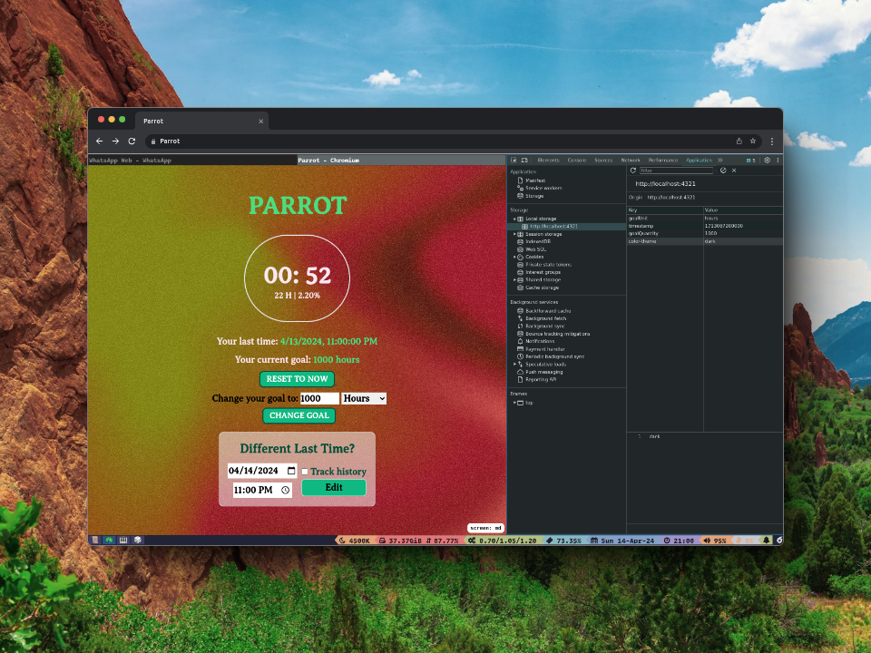
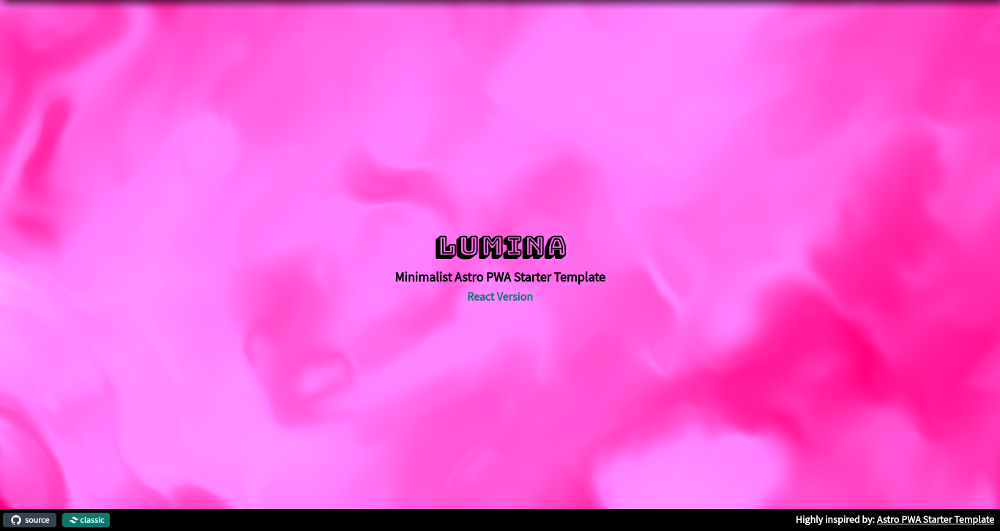

# LUMINA

### [Live Demo](https://lumina-sigma.vercel.app/)

## Alternate Themes

### Tranquiluxe (UVCanvas, Animated with this [React Library](https://uvcanvas.com/docs/components/tranquiluxe))

### [Live Demo](https://lumina-git-uvcanvas-jamerrq.vercel.app/)

## About

Template for a PWA with Astro and TailwindCSS. Prettier, EsLint and VsCode
settings included.

---

Generated from
[`astro-pwa-starter`](https://github.com/shaunchander/astro-pwa-starter), star
it, not this :)
