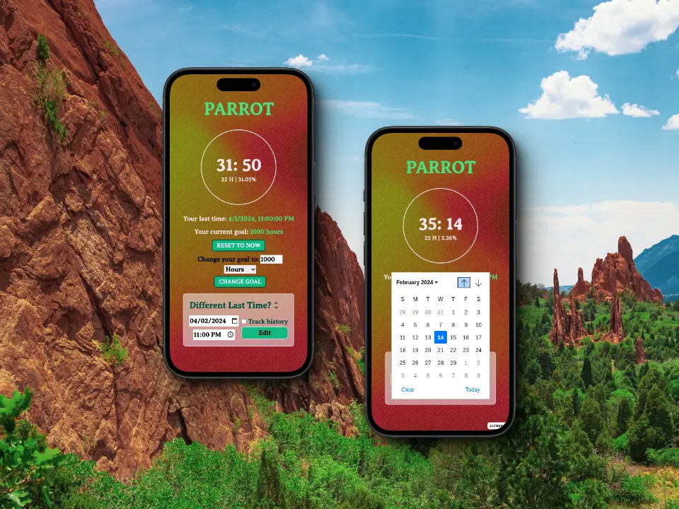

# PARROT

<!--  -->

## Description

Parrot is a simple application to help you keep track of that bad habit you want
to get rid of. Set a goal, track your progress and save it across sessions.

## Powered by

[Lumina](https://github.com/jamerrq/lumina) - Minimalist PWA Astro Starter Template

> [!NOTE]
> Parrot is during development phase, so expect some bugs and missing features.
> If you find any bug or have a suggestion, please open an issue.

## TODO

- [ ] Option to track multiple habits
- [ ] Allow the user to save the history for cool graphs
- [ ] Added cool animations and sounds
